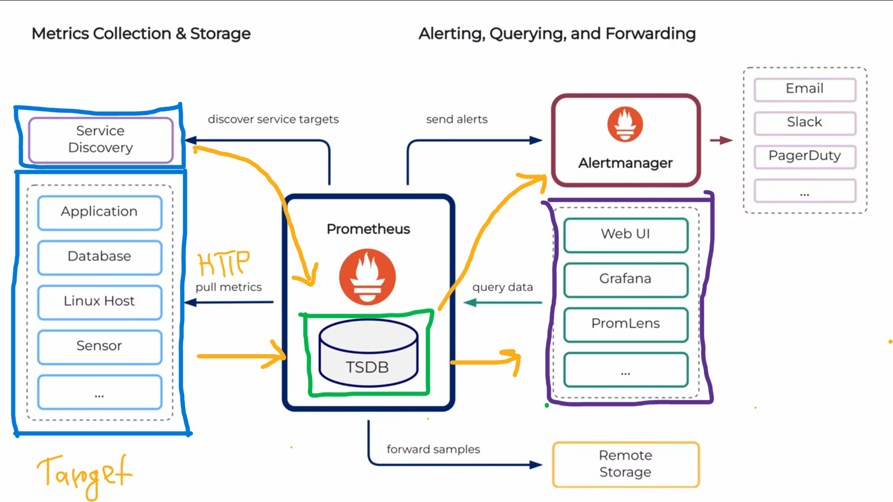

# Prometheus
### What is Prometheus?
It's a matrics based monitoring system written in go. 
**Functionality:**
1. track and expose metrics
2. collect and store metrics
3. query in the metrics
4. debug, alert, design dashboard


### Prometheus System Architecture


**How it works?**

Prometheus is a pull based monitoring system over HTTP from a set of system and services (this call taget).

From the target, Prometheus pulls data autometically or Manual exporter and store as Time Series DataBase(TSDB).The term time series refers to the recording of changes over time. 

### **Core Features**
Prometheus's main features are:

- a multi-dimensional **data model** with time series data identified by metric name and key/value pairs
- PromQL, a flexible **query language** to leverage this dimensionality
- no reliance on distributed storage; single server nodes are autonomous
- time series collection happens via a **pull model** over HTTP
- pushing time series is supported via an intermediary gateway
- targets are discovered via **service discovery** or static configuration
- multiple modes of graphing and dashboarding support

[More Information](https://prometheus.io/docs/introduction/overview/)

### Configuration

**Downloading Prometheus**: 
[Download the latest release](https://prometheus.io/download/) of Prometheus for your platform, then extract it:
```bash
tar xvfz prometheus-*.tar.gz
cd prometheus-*
```
The Prometheus server is a single binary called prometheus (or prometheus.exe on Microsoft Windows). We can run the binary and see help on its options by passing the `--help` flag.

```bash
./prometheus --help
usage: prometheus [<flags>]

The Prometheus monitoring server

. . .

```
**Configuring Prometheus**
Prometheus configuration is YAML. The Prometheus download comes with a sample configuration in a file called prometheus.yml that is a good place to get started.
```bash
## prometheus.yml

global:
  scrape_interval:     15s
  evaluation_interval: 15s

rule_files:
  # - "first.rules"
  # - "second.rules"

scrape_configs:
  - job_name: prometheus
    static_configs:
      - targets: ['localhost:9090']
```

There are three blocks of configuration in the example configuration file: `global`, `rule_files`, and `scrape_configs`.

The `global` block controls the Prometheus server's global configuration.
- `scrape_interval`, controls how often Prometheus will scrape targets.
- `evaluation_interval`, controls how often Prometheus will evaluate rules.

The `rule_files` block specifies the location of any rules we want the Prometheus server to load.
- `scrape_configs`, controls what resources Prometheus monitors. 

The `job_name` is a label that is attached to all metrics scraped from this configuration.
- `static_configs` is a list of targets that Prometheus will scrape. Each target is specified by a `targets` key, which is a list of host:port pairs.

Prometheus expects metrics to be available on targets on a path of `/metrics`. So this default job is scraping via the URL:` http://localhost:9090/metrics`.

The time series data returned will detail the state and performance of the Prometheus server.


**To start Prometheus:**
```bash
  ./prometheus --config.file=prometheus.yml
```


Once Prometheus is running, we can access its web UI by navigating to `http://localhost:9090` in a web browser. The web UI provides several features, including:
1. **Graphing**: We can use the "Graph" tab to visualize metrics over time. We can enter PromQL queries to create graphs and analyze the data.
2. **Querying**: The "Query" tab allows us to run PromQL queries to retrieve specific metrics and their values.
3. **Status**: The "Status" tab provides information about the Prometheus server, including its configuration, targets, and rules.
4. **Alerts**: If we have configured alerting rules, the "Alerts" tab will show the current state of alerts. 
