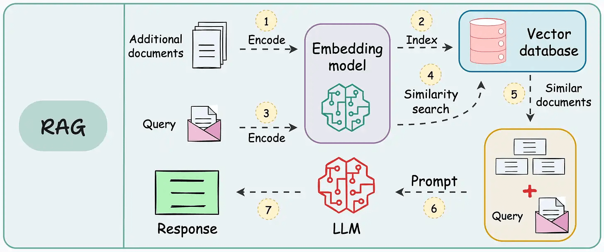

## What is RAG?
Retrieval-Augmented Generation (RAG) represents a powerful and innovative approach in the field of natural language processing (NLP). RAG comes to solve  llm limitations—outdated knowledge, hallucinations, and generic responses. It enhances LLMs by integrating them with external data sources and  enables AI systems to produce more accurate and contextually relevant responses.

The retrieval-augmented generation (RAG) approach helps solve several challenges in natural language processing (NLP) and AI applications:

- Factual Inaccuracies and Hallucinations: Traditional generative models can produce plausible but incorrect information. RAG reduces this risk by retrieving verified, external data to ground responses in factual knowledge.

- Outdated Information: Static models rely on training data that may become obsolete. RAG dynamically retrieves up-to-date information, ensuring relevance and accuracy in real-time.

- Contextual Relevance: Generative models often struggle with maintaining context in complex or multi-turn conversations. RAG retrieves relevant documents to enrich the context, improving coherence and relevance.

- Domain-Specific Knowledge: Generic models may lack expertise in specialized fields. RAG integrates domain-specific external knowledge for tailored and precise responses.

- Cost and Efficiency: Fine-tuning large models for specific tasks is expensive. RAG eliminates the need for retraining by dynamically retrieving relevant data, reducing costs and computational load.

- Adaptability and Scalability Across Domains: RAG is adaptable to diverse industries, from healthcare to finance, without extensive retraining, making it highly scalable

RAG addresses these issues by allowing models to retrieve up-to-date and domain-specific information from structured and unstructured data sources, such as databases, documentation, and APIs.

The basic structure of RAG involves three key components: `indexing`, `retrieval`, and `generation`.

#### Indexing
This step involves several key steps: chunking, embedding, and storing embeddings in a database .
**Chunking**:
Chunking refers to dividing documents into smaller sections or chunks. Each chunk is a segment of the document that can be independently processed and searched. This helps in handling large documents by focusing on relevant sections rather than the entire document.

Benefits:

- Improves search efficiency.
- Enhances the relevance of retrieved information.
- Allows more precise targeting of specific information within large documents.

**Embeddings for Chunks**:
For each text chunk, then need to create text embeddings, which are numeric representations of the text in the vector space. Words with similar meanings are expected to be in closer proximity or have a shorter distance in the vector space. 

**Storing Embeddings in a Vector Database**:
After creating embeddings for each chunk, they are stored in a vector database. This database allows efficient searching and retrieval of similar documents based on their embeddings.

Vector Database:

- Stores high-dimensional vectors representing the chunks.
- Supports fast similarity searches using methods like Hierarchical Navigable Small World (HNSW), k-Nearest Neighbors (KNN), and FAISS.

#### Retrieval
When a user query enters the system, it must also be converted into an embedding or vector representation. The same model must be used for both the document and query embedding to ensure uniformity between the two.

Once the query is converted into an embedding, the system compares the query embedding with the document embeddings. It identifies and retrieves chunks whose embeddings are most similar to the query embedding, using measures such as cosine similarity and Euclidean distance.

These chunks are considered to be the most relevant to the user’s query.

One common method used for measuring similarity between embeddings is Cosine Similarity.
*Cosine Similarity:*

- Measures the cosine of the angle between two vectors. It ranges from -1 to 1, where 1 means the vectors are identical, 0 means they are orthogonal (no similarity), and -1 means they are diametrically opposed.
- This method is effective because it focuses on the direction of the vectors rather than their magnitude, making it robust to differences in vector length.

#### Generation
The retrieved text chunks, along with the initial user query, are fed into a language model. The algorithm will use this information to generate a coherent response to the user’s questions through a chat interface.